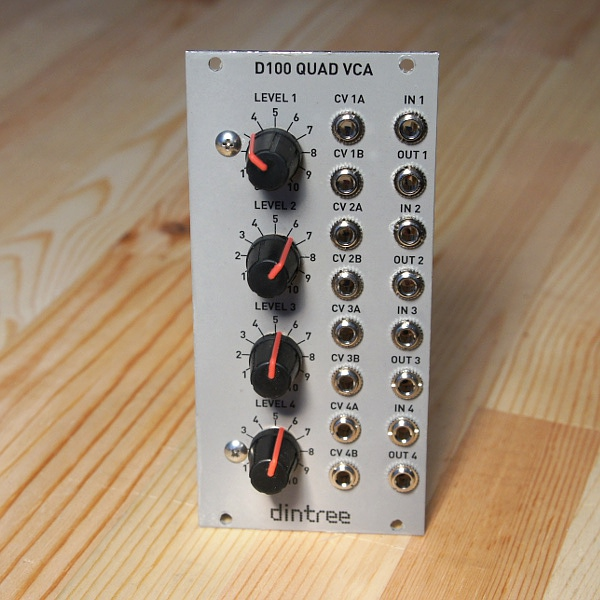

# D100 Quad VCA

The D100 is a small quad VCA based around the SSM2164 VCA chip from Analog Devices. It's now obsolete but there are second-source versions and surplus stock available of this wonderful IC. The CV inputs operate from 0-5V to go from off to fully on. Both CV A and B inputs are mixed together. Each LEVEL pot is also mixed with the CV signal. This pot can adjust the range of the CV inputs by applying an offset either in the positive or negative direction. This is very useful for achieving the desired respose from envelope generators or other modulation sources. The pot can also simply be used to open and close the VCA manually which does not require a control signal to get some sound playing. The signal path is also completely DC coupled so it can be used for audio or control voltages, although the input control is logarithmic so it is less ideal for scaling control voltages.

## Circuit Design Video

