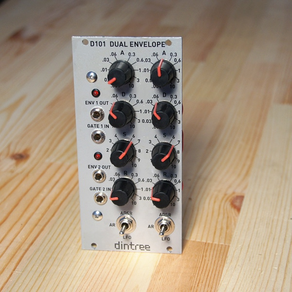

# D101 Dual Envelope

**Dual ADSR, AR and LFO Generator - 12HP Eurorack format**

The D101 is a dual envelope generatore with some interesting features. It can act as a simple ADSR (attack, sustain, decay, release) in the normal way. It also has an AR (attack, release) mode which is useful for making percussive sounds. In this mode the attack and release phases run one after another regardless of the length of the input gate. The LFO mode works like AR mode except that it automatically retriggers. At the end of the release phase the attack phase is restarted automatically. Note that there is a slight error in the panel artwork which is corrected in subsequent versions.

The circuit outputs voltages from 0-5V. Gates more than about 1V are sensed as gate on. The circuit generates both envelope channels using a PIC16F690 microcontroller. The outputs are generated with an LTC2622 dual 12-bit DAC. The outputs of the DAC are buffered before being output and the envelope LEDs are driven directly from the output envelope signals. The microcontroller updates the DAC at about 1kHz and the signal is smoothed in the output buffer to remove any steps. Except for very fast settings a nearly perfect linear ramp is output. The pot scaling goes from 1ms to 10s and uses a lookup table to make the correct time scaling in each range of pot rotation.

Specifications:

- Dual envelope generator with ADSR, AR and LFO modes
- Single PIC16F690 microcontroller and dual 12-bit DAC perform all functions
- Buffered outputs with LEDs which show current output level
- 0-5V linear ramp outputs
- Power: +12V @ 20mA, -12V @ 5mA

## Circuit Design Video

**Click to play**

## Technical Notes

The D101 is a dual envelope generator / LFO. The actual behaviour is all digital with a single PIC16F690 microcontroller (worth less than $2) doing all the processing. It controls a dual 12-bit DAC that provides each output voltage, and an amplifier to smooth and scale the outputs, and drive some LEDs. There are two toggle switches, each for setting the mode of a channel, and eight pots which are used to set the attack, decay, sustain and release times for each channel. The gates are buffered by some transistors which detect the gate signal and protect the PIC from out of range voltages.

Power for the module is all +5V internally except for the opamp. This is generated with a low power (100mA) linear voltage regulator. Normally I avoid these for all but the lowest power applications. But in this case the total current draw for the microcontroller and DAC is very low. (around 10mA or so)

A gate input is fed into a transistor for each channel. A pair of resistors divide the input voltage in half so that just a bit more than 1V is enough to turn on the transistor. This is a great little circuit for setting a fairly repeatable input voltage for triggering, and also interfacing the output to any voltage you might want in the system. The maximum gate voltage doesn't really matter, and the minimum voltage to the transistor base is limited by a reverse biased diode at the transistor base. (the maximum reverse base voltage for a transistor like this is pretty low) A standard silicon diode would be okay here, but it looks like I used a schottky since I had them around. The output from the transistor is pulled up to +5V and fed into the micro.

The microcontroller reads the value of eight pots using its internal analog to digital converter. Two mode switches are sensed to be in one of three positions each. Many PIC pins hae internal pull-ups you can use to save external resistors as shown here on S2. Because the pins for S1 don't have pull-ups inside the PIC, external resistors are used. The PIC has an internal 8MHz clock which is used. It's precise enough for this type of application.

The outputs are analog and generated by the LTC2622 DAC from Linear. This is a very good 12-bit DAC, but you can use other cheaper ones like the MCP4822 with simple code changes. An SPI port on the PIC is used to control the DAC. The output of the DAC is 0-5V which is also what we want on the output. The output signal is buffered with a TL082 opamp which increases the output drive. The 4.7K resistor and 0.1uF capacitor on the input to each opamp channel form a low-pass filter which helps to smooth the sharp transitions since the sampling rate is only about 1kHz.

The code is fairly self-explanatory. You will need to use Sourceboost BoostC to compile it, or port it to your PIC16 compiler of choice. I highly recommend that you use MPLAB or MPLAB X with a Pickit3 programmer which is available from Microchip. The Pickit is a low-cost tool that makes it really easy to use these excellent microcontrollers. There are also various C compilers available for differing levels of free-ness that can be used for developing applications like these.

Note: The library uses the flash lib that is built into Boost C for reading time lookup table data. (included in time_map.h) Make sure to add: flash.pic16.lib to your build settings (Library Files) in MPLAB or the linker will fail.
