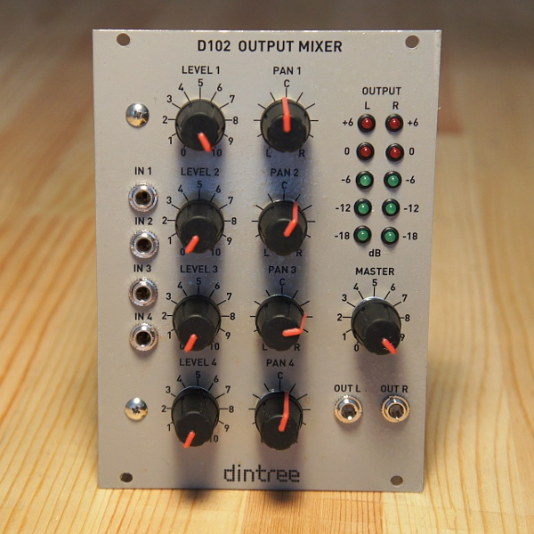

# D102 Output Mixer

**Four Input Mixer with Pan Pots and Output Level Meter - 18HP Eurorack format**

The D102 is a four input mixer designed to drive external audio equipment. Each input goes directly into a level control, is then buffered and fed to the pan pot, and then the pan pot signals are recovered and buffered before being sent to the final stereo summing amplifier. The level meters use active rectifiers and smoothing circuits to give a good and accurate response. The classic LM3915 is used for each channel to drive five LEDs per channel with 6dB intervals. The calibration of each level meter is set by a 25-turn trim pot on the meter driver board. By default I trim the levels so that 0dB on the meters equals 1Vrms on the outputs. This design uses the NE5532 op amp for excellent audio performance and low noise. The meter driver uses TL082 op amps and the LEDs are driven at low current to reduce overall power consumption, however the NE5532s draw quite a bit of current.

**Specifications:**

- Four channel audio mixer with input level and pan controls
- Line level output suitable for driving external audio equipment
- Dual 5-segment LED level meters show output level - calibrated to 0dB = 1Vrms
- Very low noise design suitable as a master output mixer
- Power: +12V @ 120mA, -12V @ 60mA

## Circuit Design Video

**Click thumbnail to play**

## Technical Notes

The D102 Output Mixer is a very simple line mixer set up for synth level on the input (10V pk-pk) and line level on the output. (a volt or two) Each input feeds a 10K level pot through a coupling capacitor to strip off any DC offset. A linear pot is used, but the loading on it by way of the first opamp stage creates a non-linear taper which works well for volume control.

Each channel is then sent into a pan pot consisting of a linear dual-gang pot. This gives a 6dB dip in the centre position, which is a popular pan pot taper and simple to produce with a linear pot. Each pot output is buffered so as to not load it down and change the response. All the buffered outputs from both pan pot channels are then summed into the main left and right outputs amps via the stereo master volume control. The left and right signals are then sent to the main outputs and also to the meter circuits.

Two small LED level meters are included which is handy for checking the output levels. Each channel is rectified using an active absolute value circuit consisting of two opamp channels. The output is slowed down using a 0.1uF capacitor across the feedback path on the second opamp. The positive-going voltage is then passed through a multi-turn trim pot which is used to calibrate the meter to a known output level.

Finally the signal is fed into the famous LM3915 LED display driver. The LM3915 is run in bargraph mode to give a typical level meter appearance. Only 5 of the 10 outputs on the chip are used by skipping every other output line. Since the LM3915 has outputs spaced 3dB apart, the finished meter shows level increases of 6dB instead.
