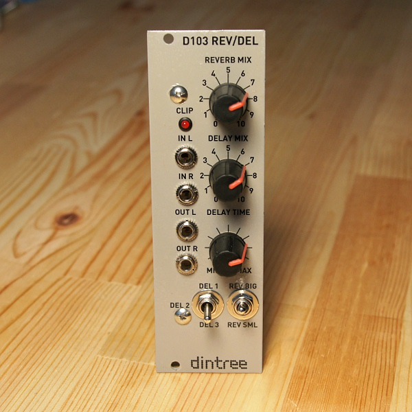

# D103 Reverb / Delay

**Stereo Reverb and Delay Digital Effects Processor - 8HP Eurorack format**

The D103 is a stereo effects processor based around the Spin Semiconductors FV-1 digital effects processor IC. It runs custom programs and can produce both reverb and delay effects at the same time. The level is internal adjusted down and then up again so that large signals of more than 10Vpk-pk can be input without clipping. The output is filtered using an active low pass filter with gain. A clip LED shows when the internal DSP core is clipping. The controls allow the reverb mix, delay mix and delay time to be adjusted. Two different reverb algorithms and three different delay algorithms can be chosen and both reverb and delay can work simultaneously. There is no dry signal path so this unit is based used mixed in with a dry signal from the source.

Note: The hardware for this design is available, but you will have to create your own algorithms.

**Specifications:**

- Stereo effects processor with stereo input and output.
- Can handle input signals of greater than 10Vpk-pk.
- Simultaneous reverb and delay processing.
- Good audio performance and high quality output filtering using an active low pass filter.
- Power: +12V @ 60mA, -12V @ 5mA

## Technical Notes

The D103 Reverb / Delay module uses the flexible FV-1 audio DSP chip from Spin Semiconductor to create high quality reverb and delay effects. This circuit is very simple in that it doesn't have an analog dry path or wet/dry mix. After using the D103 together with the D102 it seems like modifying one or the other would be nice... either a dedicated effects loop on the D102 or a wet/dry control and proper analog bypass path on the D103 would make the setup work better.

The D103 loads DSP programs from a small serial EEPROM. Up to 8 programs can be recalled, and two switches are used to change between various combinations of reverbs and delays. The programs are arranged so that in any switch setting, a correct program is selected.

Input signal is attenuated with the input resistors and DC is blocked since the input signal can be a maximum of about 3.3V pk-pk with a 1.65V offset at the input to the FV-1. The FV-1 runs on a tiny 32768Hz watch crystal which is multiplied 1024 times with an internal PLL. Three pots and two switches set the program and parameters.

The outputs from the FV-1 feed into multi-feedback (MFB) filters/amplifiers which remove high frequency noise that is inherent in the DAC outputs from the FV-1 and also provide gain to bring the signal level back up to about 10V pk-pk. This makes the D103 useful to patch anywhere in the modular synth audio signal path.

Algorithms are not provided at this time, but there are many examples at the manufacturer's site, or circuit can be rearranged to use some internal demo programs instead. (see the FV-1 datasheet for help about this)
