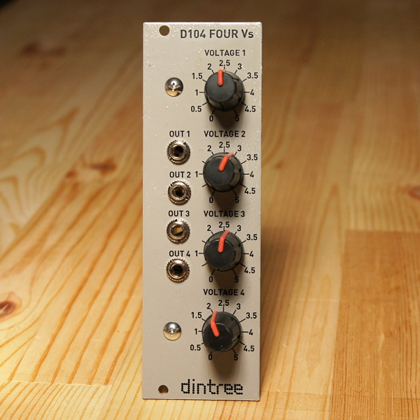

# D104 Four Vs

**Four Channel Voltage Source with Buffering - 8HP Eurorack format**

The D104 is a very simple voltage source. Sometimes it's nice to have a CV available to control something manually. The D104 has four pots which can each dial in a voltage from 0-5V. Each channel is buffered internally and fed to an output jack.

**Specifications:**

- Four channel voltage source with pots
- Internal buffers for each channel
- Power: +12V @ 15mA, -12V @ 5mA

## Circuit Design Video

**Click thumbnail to play**

What could be simpler? Four buffered pots set to generate voltages from 0-5V to use for whatever you want. A low-power +5V regulator makes 5V, there are four pots which make 0-5V, and four opamp channels buffer these voltages. Simple, useful.
