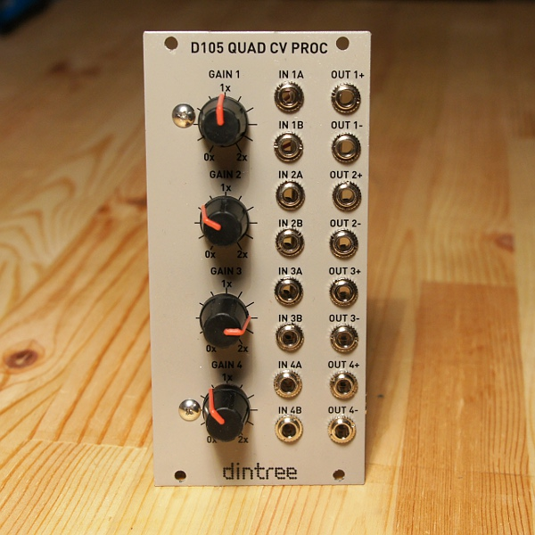

# D105 Quad CV Proc

**Quad Control Voltage Processor - 12HP Eurorack format**

The D105 offers the ability to mix and scale control voltages (and audio signals) and provide both inverted and non-inverted outputs simultaneously. Each of four channels has an active input mixer with two inputs, a gain control that scale the voltages from 0-2x, and dual buffered outputs, one inverted and other non-inverted.

**Specifications:**

- Four channels of voltage processing
- Designed for CV signals, but able to process audio signals as well
- Activing mixing with two inputs per channel
- Gain control with gain range from 0-2x.
- Simultaneous inverted and non-inverted buffered outputs
- Power: +12V @ 20mA, -12V @ 20mA

## Circuit Design Video

**Click thumbnail to play**

## Technical Notes

A very useful module for mixing and scaling either CV or audio signals, the D105 Quad CV Proc has 4 sets of circuits for doing just that. Two inputs are actively summed with an opamp stage and then passed into a linear pot. The pot is designed to scale CVs linearly, but it can be used for audio too. We want a range of 0-2x (0-200%) on the pot, so at the mid-point we get 50% of the input signal since the first opamp stage has a gain of -1 for each input. (unity gain, but inverted output) The output from the pot is buffered with a gain of 2, so we are up to -100% now. This second stage output becomes the inverting output signal and feeds to the - output jack. Another inverting stage this time with a gain of -1 produces the + output which is now in phase with the input, and exactly opposite in phase to the - output.
