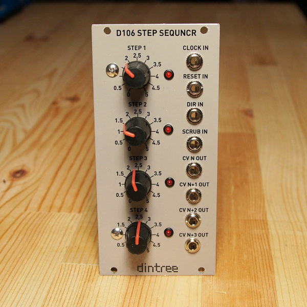

# D106 Step Sequencer

**Four Stage Step Sequencer with Scrubbing and Multiple Outputs - 12HP Eurorack format**

The D106 is a very simple step sequencer with four stages. The outputs are completely analog and can generate any voltages from 0-5V. There are four outputs which each output a voltage from one of the pots at a time. They rotate around as the sequencer advances steps meaning that you can create sequences that are offset by 1-3 steps from the actual step position. This is accomplished internally by 4x 4:1 analog multiplexers. Each output is buffered by an amplifier stage before being sent to the output jack.

To control the sequencer a clock can be input. It accepts pulses and triggers when the pulse rises above about 1V. The sequencer can be clocked up to about 500Hz and probably higher with some software changes. A reset input will hold the sequencer at step 1 when high. The direction input will make the sequencer count backwards when high. The scrub input is a special type of input which allows analog addressing of the stages. A voltage from 0-5V will select one of the four steps. Feed an LFO or envelope generator into the scrub input to create interesting sequences. The clock and scrub inputs can be used together but will interact in interesting ways.

**Specifications:**

- Four stage step sequencer
- Four buffered outputs generate all pot outputs simultaneously
- Clock, direction and reset inputs for clocked control
- Scrub input for analog stage addressing control
- Power: +12V @ 30mA, -12V @ 10mA

## Circuit Design Video

**Click to play**

## Technical Notes

The D106 is an interesting combination of analog and digital electronics together. The step sequencer takes four voltages from pots and outputs them on four outputs labeled N, N+1, N+2 and N+3. Depending on the current step position, each pot signal is output on one of the four jacks. These outputs "rotate" around as the steps progress.

In this circuit a PIC16F690 microcontroller is used merely as a glorified counter. Inputs for clock, reset and direction are buffered using the same circuit seen on the D101 module for providing trigger inputs to the PIC. The scrub input is analog and allows the steps to be accessed by a CV instead of by a clock. As this voltage changes, a stage is addressed automatically. If the voltage is not changing (or disconnected, hence at 0V) the clock and reset inputs take priority.

The scrub input is buffered and protected from going out of range by two schottky diodes. In retrospect those diodes should be on the output of the opamp, since during turn-on the opamp might send out spikes that could be bad for the PIC. If they go on the opamp output make sure they are downstream of the 1K resistor so that the opamp has a current limit before hitting the diodes.
