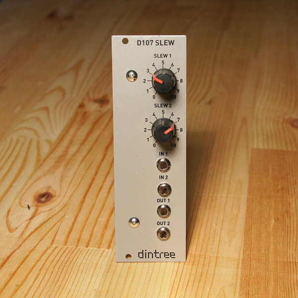

# D107 Slew

**Dual Slew Rate Limiter - 8HP Eurorack format**

The D107 is a very simple dual slew rate limiter. It can be used for portamento effects or to smooth out a stepped voltage from a sequencer, or for general audio or CV smoothing. Each channel contains a buffer with 100K input impedance suitable for pitch CVs. The slew pot affects the charging of a large capacitor connected to a second amplifier. The second amp provides buffering for output to isolate the output jack from the actual slewing function.

**Specifications:**

- Dual slew rate limiter
- Control range of 0-10s (approx.)
- Power: +12V @ 5mA, -12V @ 5mA

## Circuit Design Video

**Click thumbnail to play**

## Technical Notes

The idea behind the D107 is very simple, and probably many circuits like it exist. There are two identical chanels. The input signal is buffered so that the input signal driving impedance has no effect on the performance of the slew limiting part. A high value 250K linear pot controls the charging and discharging of a pair of 10uF capacitors joined back to back. (non-polarized combination with total value of around 5uF) The voltage on the capacitor is buffered with an opamp stage. Because the opamp is a JFET input type, it doesn't drain any appreciable charge off the capacitor. The second opamp stage drives the output.
