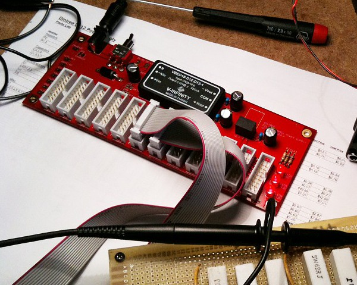

# D110 Power Supply

**High-end Eurorack Power Supply**

The D112 Power Supply is a high quality Eurorack power supply designed for a single row of modules. It can supply 625mA at +12V and 625mA at -12V using a DC-DC dual-output module. Additionally it provides +5V at 500mA using a DC-DC converter on the +5V line as well. A single +12V supply powers the unit.

Note: We do not have anymore PCBs available. Please don't ask for them as I don't have any plans of producing more.

**Specifications:**

- +12V and -12V at 625mA each
- +5V at 500mA
- single +12V power input required (1-2A depending on load)
- high-efficiency switching design
- 12 power bus outputs
- power bus indicator LEDs

## Technical Notes

The D112 uses a high-efficiency DC-DC converter to supply +12V and -12V. A dual-output isolated unit is used to provide both outputs. (although not used for the isolation) Additionally a +5V output is provided via a small DC-DC converter module. This can be omitted or a linear type can be used for lower cost. The input has a DC power connector and a switch. A reverse-polarity protection diode is included in the input. An optional chassis bonding jumper allows the board to be grounded to the chassis by way of one of the mounting screws if desired.

DC-DC modules come and go, and of this writing the one specified in the parts list appears to be discontinued. The package outline is a common style and there are many models to choose from. Make sure to use a dual-output 12V type. The remote pin is not supported and you should probably choose one without a remote function to be sure it will work.
